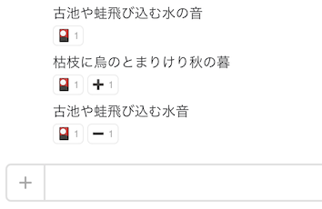

# hubot-slack-ikku



[slack-ikku](https://github.com/hakatashi/slack-ikku)のhubot-pluginです

hubotがjoinしているchannelから一句を見つけて自動でreactionをつけます

## インストール

npmでインストール

```
$ cd /path/to/hubot
$ npm install --save knjcode/hubot-slack-ikku
```

`external-scripts.json`へスクリプトを登録

```
$ cat external-scripts.json
[
  "hubot-slack-ikku"
]
```

## 設定

#### 字余り、字足らずを何文字まで許容するかを環境変数で設定可能

- 字余り `HUBOT_SLACK_IKKU_MAX_JIAMARI` (デフォルトは 1)
- 字足らず `HUBOT_SLACK_IKKU_MAX_JITARAZU` (デフォルトは 0)

#### reactionする絵文字を環境変数で設定可能

- 一句 `HUBOT_SLACK_IKKU_REACTION` (デフォルトは flower_playing_cards)
- 字余り `HUBOT_SLACK_IKKU_JIAMARI_REACTION` (デフォルト未設定)  
  値を設定すると字余りの場合にreactionします
- 字足らず `HUBOT_SLACK_IKKU_JITARAZU_REACTION` (デフォルト未設定)  
  値を設定すると字足らずの場合にreactionします

## 参考

[slack-ikku](https://github.com/hakatashi/slack-ikku)を参考にさせて頂きました

## ライセンス

MIT
